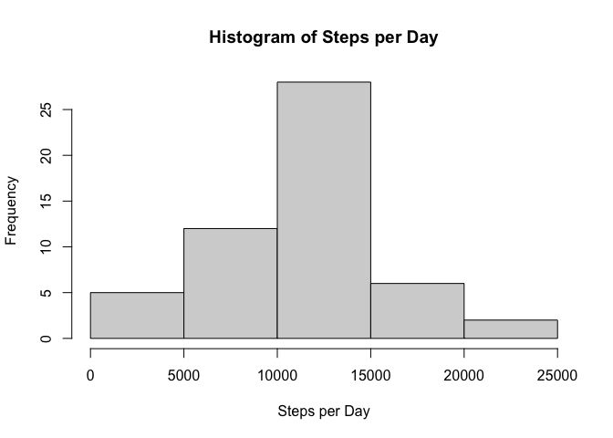
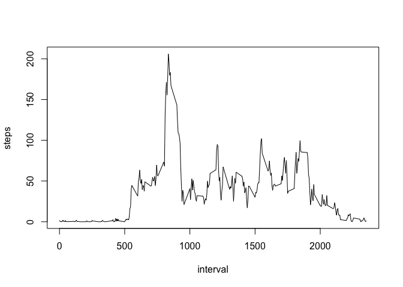
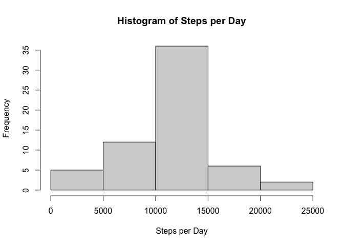
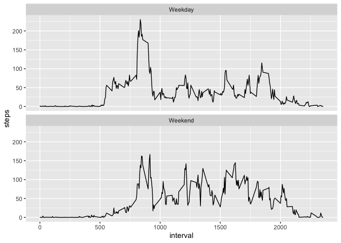

## Loading and preprocessing the data

The raw data was originally archived in a zip format. Using the following R code the data archive is unzipped, loaded into the the environment, and the date variable transformed from the character class into the date class.


```r
unzip("activity.zip")
Activity <- read.csv("activity.csv")
Activity$date <- as.Date(Activity$date)
summary(Activity)
```

```
##      steps           date               interval   
##  Min.   :  0    Min.   :2012-10-01   Min.   :   0  
##  1st Qu.:  0    1st Qu.:2012-10-16   1st Qu.: 589  
##  Median :  0    Median :2012-10-31   Median :1178  
##  Mean   : 37    Mean   :2012-10-31   Mean   :1178  
##  3rd Qu.: 12    3rd Qu.:2012-11-15   3rd Qu.:1766  
##  Max.   :806    Max.   :2012-11-30   Max.   :2355  
##  NA's   :2304
```

## What is mean total number of steps taken per day?


```r
steps_per_day <- aggregate(steps ~ date, data=Activity, sum)
hist(steps_per_day$steps,xlab="Steps per Day", main = "Histogram of Steps per Day")
```

<!-- -->

```r
mean_steps <- mean(steps_per_day$steps)
median_steps <- median(steps_per_day$steps)
```

The arithmatic mean for the number of steps taken per day is 10766.19 and the median is 10765.

## What is the average daily activity pattern?

```r
steps_per_interval <- aggregate(steps ~ interval, data=Activity, mean)
plot(steps_per_interval$interval, steps_per_interval$steps, type ="l", xlab = names(steps_per_interval)[1], ylab = names(steps_per_interval)[2])
```

<!-- -->

```r
max_int <- steps_per_interval$interval[which.max(steps_per_interval$steps)]
```
The 5 min interval with the highest average number of steps is 835. 

## Imputing missing values
We will determine how many missing values exist by using a sum function on Boolean objects where True equals 1 and False equals 0. Then we replace the *NA* values using the interval means.

```r
missing_values <- sum(is.na(Activity$steps))
New_Activity <- cbind(Activity,steps_per_interval$steps)
New_Activity$steps[is.na(New_Activity$steps)] <- New_Activity$`steps_per_interval$steps`[is.na(New_Activity$steps)]
New_Activity <-New_Activity[,1:3]
New_steps_per_day <- aggregate(steps ~ date, data=New_Activity, sum)
hist(New_steps_per_day$steps,xlab="Steps per Day", main = "Histogram of Steps per Day")
```

<!-- -->

```r
New_mean_steps <- mean(New_steps_per_day$steps)
New_median_steps <- median(New_steps_per_day$steps)
mean_diff <- mean_steps - New_mean_steps
median_diff <- median_steps - New_median_steps
```
After replacing the 2304 missing values with the interval means, the mean number of steps taken per day is 10766.19 with a difference of 0 from the previous mean showing no change. However, The median is now 10766.19, which a difference of -1.19 from the previous mean.

## Are there differences in activity patterns between weekdays and weekends?

```r
#Defining weekend days
weekend <- c("Saturday","Sunday") 
#using a Boolean test to determine weekends and weekdays based on the 'weekend' object and adding it as a factor variable with 'Weekend' and 'Weekday' labels for the TRUE and FALSE labels.
New_Activity$Day_Type <- factor((weekdays(New_Activity$date) %in% weekend ),levels = c(TRUE,FALSE), labels = c("Weekend","Weekday")) 
#Splitting the data based on the type of day.
Day_Type_Activity <- split(New_Activity,New_Activity$Day_Type) 
  Weekday_Activity <- Day_Type_Activity$Weekday
  Weekend_Activity <- Day_Type_Activity$Weekend
#Calulating the interval mean for each day type.
Weekday_Mean <- aggregate(steps ~ interval, data = Weekday_Activity, mean)
Weekend_Mean <- aggregate(steps ~ interval, data = Weekend_Activity, mean)
  Weekday_Mean$Day_Type <- "Weekday"
  Weekend_Mean$Day_Type <- "Weekend"
Mean_Activity <- rbind.data.frame(Weekday_Mean,Weekend_Mean)
ggplot(data = Mean_Activity)+
  geom_line(mapping = aes(x=interval, y=steps))+
  facet_wrap(~Day_Type, nrow=2)
```

<!-- -->
